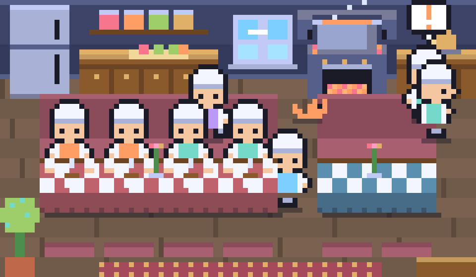

# agentview

**Every Claude Code session you're running, in one terminal window, and a little pixel kitchen where every one of them is a chef wandering around.**



<sub>Working chefs are up and cooking, chefs that need you wave from the order bell, and inactive chefs sit at the tables with a coffee. Real day/night window, and a cat.</sub>

If you run several Claude Code agents in parallel, each one lives in its own terminal. agentview reads them all in one place without touching them. It tails the conversation logs Claude Code already writes to disk and shows your prompts, Claude's replies and a one-line summary of every tool call.

It is **read-only**: it never sends anything to your agents, never calls an API and never leaves your machine. You still reply in each agent's own terminal.

## Features

- **Merged feed:** every session in one scrolling feed, each tagged with its name in its own color.
- **Grid:** one pane per session, side by side.
- **Single session:** click a session in the sidebar to see it full-screen.
- **Kitchen:** a shared pixel room where each session is a chef in its own color with a name tag. Working chefs move around the stove and cutting board, inactive ones sit at the tables. Pure eye candy.
- **Live status:** each session shows 🟢 working, ⚪ needs you or ⚫ inactive, and the sidebar is sorted so the sessions that need you are at the top.
- **Zero setup:** Python plus one dependency ([Textual](https://github.com/Textualize/textual)). No server, no background service, no config.
- **Mac, Linux and Windows.**

## Install

Requires Python 3.9+ and [Claude Code](https://claude.com/claude-code).

```bash
git clone https://github.com/jlee056/agentview.git
cd agentview
pip install -r requirements.txt
python agentview.py
```

It picks up every session from today automatically, including ones you start after it's open.

## Using it

Click in the left sidebar, or use the shortcuts:

| Key | View |
|---|---|
| `m` | All sessions, merged into one feed |
| `g` | Grid, one pane per session |
| `k` | Kitchen |
| `n` | Show or hide the chefs' name tags (kitchen) |
| `f` | Freeze or unfreeze auto-scroll |
| `q` | Quit |

Clicking a session name shows that session alone.

### The kitchen

Purely for fun: the room needs a terminal about 145 columns wide (96 for the room plus the sidebar); a warning shows if it's too narrow. Press `n` to hide the name tags.

| Session status | What the chef does |
|---|---|
| Working | Up and about: stirs at the stove, chops at the board, looks out the window, wanders the aisles |
| Needs you | Walks to the order bell, waves, and shows a red `!` bubble (the bell rings and its lamp flashes) |
| Inactive (terminal closed) | Sits at one of the two tables with a steaming coffee |

Each chef wears its session's color and carries its session name as a tag. The window shows the real time of day (day, dusk, or night with stars and a moon), the stove flickers, the pot steams, and a cat roams around.

The room is drawn with half-block characters (`▀`), two pixels per character cell, so it works in any modern terminal with truecolor support. Chefs walk on a 24x14 grid using BFS pathfinding and wait for each other in the aisles. No images, no extra dependencies.

## How it works

| Data | Where it comes from |
|---|---|
| Conversations | `~/.claude/projects/<project>/<session>.jsonl`, polled every 2 s. Each file is read by byte offset, so only new lines are parsed. |
| Status | `~/.claude/sessions/<pid>.json`, which Claude Code writes for every open terminal. A live process reporting `busy` is working, any other live process needs you, and a session with no live process is inactive. If that folder doesn't exist, status is guessed from the log instead. |

Hidden on purpose: thinking, tool output and subagent transcripts. Only the conversation and one-line tool summaries are shown.

On Windows, `~` is `C:\Users\<you>`.

## Files

| File | What it does |
|---|---|
| `agentview.py` | The Textual app: sidebar, views, polling |
| `sessions.py` | Finds today's logs, tails them, parses records into events, reads live status |
| `render.py` | Colors and line formatting |
| `room.py` | The kitchen: pixel room, sprites, chef wandering and drawing |

## Privacy

agentview only reads files already on your machine and makes no network requests. Your session logs can contain anything you've typed into Claude Code, so be careful sharing screenshots of it.

## Credits

The half-block pixel approach was inspired by [recon](https://github.com/gavraz/recon)'s Tamagotchi view. The colors are from [Tokyo Night](https://github.com/tokyo-night/tokyo-night-vscode-theme).

## License

[MIT](LICENSE)
