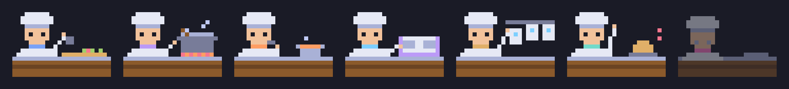

# agentview

**Every Claude Code session you're running, in one terminal window, and a kitchen full of pixel chefs cooking them.**



<sub>Chopping (Edit) · stirring (Bash) · tasting (Read/Grep) · recipe book (web/MCP) · ticket rail (subagents) · order bell (needs you) · asleep (inactive)</sub>

If you run several Claude Code agents in parallel, each one lives in its own terminal. agentview reads them all in one place without touching them. It tails the conversation logs Claude Code already writes to disk and shows your prompts, Claude's replies and a one-line summary of every tool call.

It is **read-only**: it never sends anything to your agents, never calls an API and never leaves your machine. You still reply in each agent's own terminal.

## Features

- **Merged feed:** every session in one scrolling feed, each tagged with its name in its own color.
- **Grid:** one pane per session, side by side.
- **Single session:** click a session in the sidebar to see it full-screen.
- **Kitchen:** each session is an animated pixel chef. The chef's station follows the tool the agent is using, and a pot shows how full its context window is.
- **Live status:** each session shows 🟢 working, ⚪ needs you or ⚫ inactive, and the sidebar is sorted so the sessions that need you are at the top.
- **Zero setup:** Python plus one dependency ([Textual](https://github.com/Textualize/textual)). No server, no background service, no config.
- **Mac, Linux and Windows.**

## Install

Requires Python 3.9+ and [Claude Code](https://claude.com/claude-code).

```bash
git clone https://github.com/jlee056/agentview.git
cd agentview
pip install -r requirements.txt
python agentview.py
```

It picks up every session from today automatically, including ones you start after it's open.

## Using it

Click in the left sidebar, or use the shortcuts:

| Key | View |
|---|---|
| `m` | All sessions, merged into one feed |
| `g` | Grid, one pane per session |
| `k` | Kitchen |
| `f` | Freeze or unfreeze auto-scroll |
| `q` | Quit |

Clicking a session name shows that session alone.

### The kitchen

| What the agent is doing | What the chef does |
|---|---|
| `Edit`, `Write` | Chops at the cutting board |
| `Bash` (and any tool not listed) | Stirs a pot on the stove |
| `Read`, `Grep`, `Glob` | Tastes from a bowl |
| `WebSearch`, `WebFetch`, `Skill`, MCP tools | Reads the recipe book |
| `Agent`, `Task` | Works the ticket rail; `crew ☻☻` counts subagents active in the last 30 s |
| Waiting on you | Rings the order bell: `( ! ) order up` |
| Terminal closed | Falls asleep (dimmed) |

The **pot** under each chef is context-window usage from the session's last reply. Logs don't record the window size, so it assumes 200k tokens, and 1M once a session goes past 200k.

The chefs are drawn with half-block characters (`▀▄`), two pixels per character cell, so they work in any modern terminal with truecolor support. No images, no extra dependencies.

## How it works

| Data | Where it comes from |
|---|---|
| Conversations | `~/.claude/projects/<project>/<session>.jsonl`, polled every 2 s. Each file is read by byte offset, so only new lines are parsed. |
| Status | `~/.claude/sessions/<pid>.json`, which Claude Code writes for every open terminal. A live process reporting `busy` is working, any other live process needs you, and a session with no live process is inactive. If that folder doesn't exist, status is guessed from the log instead. |
| Subagents | `<session>/subagents/*.jsonl` files written in the last 30 s. |

Hidden on purpose: thinking, tool output and subagent transcripts. Only the conversation and one-line tool summaries are shown.

On Windows, `~` is `C:\Users\<you>`.

## Files

| File | What it does |
|---|---|
| `agentview.py` | The Textual app: sidebar, views, polling |
| `sessions.py` | Finds today's logs, tails them, parses records into events, reads live status |
| `render.py` | Colors and line formatting |
| `kitchen.py` | The kitchen's pixel canvas, sprites and cards |

## Privacy

agentview only reads files already on your machine and makes no network requests. Your session logs can contain anything you've typed into Claude Code, so be careful sharing screenshots of it.

## Credits

The half-block pixel approach was inspired by [recon](https://github.com/gavraz/recon)'s Tamagotchi view. The colors are from [Tokyo Night](https://github.com/tokyo-night/tokyo-night-vscode-theme).

## License

[MIT](LICENSE)
